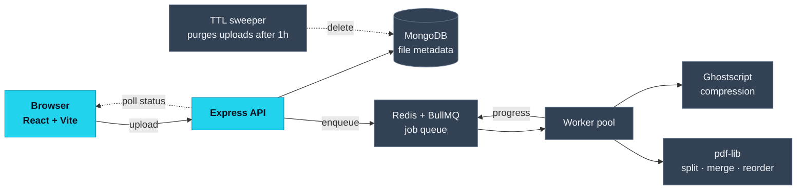

# Abhijeet Chandak

I build production web applications end to end — from API design and data modeling,
through React frontends and AWS deployments, to the live debugging that comes after.

  

  

---

## About

I'm a full-stack engineer with **4+ years** of experience, currently at **Response Informatics**,
building enterprise client products on a five-person team — Node.js/TypeScript services backed by
PostgreSQL and MongoDB, React frontends, and deployments I own on AWS.

Before that I spent two years building and running the web platform behind a Saudi sustainability
company's operations — **50,000+ users**, owned end to end, working directly with stakeholders
across timezones without a PM buffer. That role is where I learned that shipping a feature is
maybe half the job; the other half is everything that happens to it in production afterwards.

Lately I've been focused on taking **LLM-powered features** from API integration through the
hardening that makes them dependable enough to put in front of real users.

> My professional work lives in private client repositories, so none of it is published here.
> What's on this profile is side projects, experiments, and tools I built for myself.

---

## Something I built

Most of my work sits behind private repositories, so here's the shape of one instead —
**Docnify**, a PDF toolkit I wrote. The interesting problem wasn't the PDF manipulation;
it was that Ghostscript compression takes long enough to block a request. So it doesn't
run in one:

The upload returns immediately, the heavy work happens on a worker, and the browser polls
for progress — so a 40 MB compression never holds a connection open. Uploaded files are
nobody's business but the uploader's, so a sweeper deletes them an hour later whether the
job finished or not.

---

## Currently learning

Mostly in the gaps between what I've had to build and what I haven't yet:

- **System design** — caching strategies, load balancing, queue-backed workloads, and the
  trade-offs behind distributed systems. Working through HLD and LLD for real applications
  rather than toy examples.
- **Cloud architecture** — going deeper than the EC2/RDS/S3 surface I use day to day, into
  deployment patterns, cost, and failure modes.
- **AI engineering** — prompt design, evaluation, and the production hardening that separates
  a demo from a feature people can rely on.

---

## Projects

| Project | What it does | Built with | |
|---|---|---|---|
| **Docnify PDF** | Browser-based PDF toolkit — compress, split, extract, reorder and remove pages, with batch processing. Architecture above. | `React` `Node.js` `Express` `MongoDB` `Redis` `BullMQ` `Ghostscript` | *private* |
| **AI Knowledge Quiz Builder** | Generates a five-question multiple-choice quiz on any topic using Google Gemini, grounded with Wikipedia context to keep questions factual. JWT auth scopes history and per-question review to each user. | `React` `Vite` `Node.js` `Express` `MySQL` `Gemini` | **[Code](https://github.com/abhijeet-chandak/ai-knowledge-quiz-builder)** · [Demo](https://ai-knowledge-quiz-builder.vercel.app) |
| **ApplyTracker** | Chrome extension that captures job applications straight off the listing page — it recognises LinkedIn, Indeed, Greenhouse, Lever and Workday — then tracks each through to offer with reminders and CSV/JSON export. Everything lives in local storage: no account, no server, nothing to leak. | `JavaScript` `Manifest V3` `Chrome APIs` | *private* |
| **MeetNotes** | Chrome extension putting a floating notes panel inside Google Meet, Zoom and Teams — agenda planning, timestamped notes, exportable action items. Entirely local: no backend, no analytics, no login. | `JavaScript` `Manifest V3` `Chrome APIs` | *private* |

Write-ups and screenshots at **[abhijeetchandak.me/#projects](https://www.abhijeetchandak.me/#projects)**

---

## Tech Stack

<table>
<tr><td><b>Backend</b></td><td>

</td></tr>
<tr><td><b>Frontend</b></td><td>

</td></tr>
<tr><td><b>Data</b></td><td>

</td></tr>
<tr><td><b>Cloud&nbsp;&&nbsp;DevOps</b></td><td>

</td></tr>
<tr><td><b>AI</b></td><td>

</td></tr>
</table>

---

## Experience

| Role | Company | Period | Location |
|---|---|---|---|
| **Software Engineer (Full Stack)** | Response Informatics | Sep 2025 – Present | Hyderabad · On-site |
| **Full Stack Developer** | Yadgreen Saudi Arabia | Jun 2023 – Aug 2025 | India · Remote |
| **Software Engineer Intern** | Mindbody | Jan 2023 – Jun 2023 | Pune · Hybrid |
| **Software Engineering Intern** | Magna Automotive India | Jul 2022 – Jan 2023 | Pune · Hybrid |
| **Web Developer** | Sarasvan Infosolutions | Nov 2020 – Dec 2021 | Nashik · On-site |

> **Recognition** — selected for a three-month on-site assignment at Yadgreen's Bahrain
> headquarters, in recognition of consistent high-quality delivery.

B.E. Information Technology, Pimpri Chinchwad College of Engineering — CGPA 9.59/10 ·
Full responsibilities at **[abhijeetchandak.me/#experience](https://www.abhijeetchandak.me/#experience)**

---

  

**Open to opportunities** — if you're hiring, have a question, or just want to talk shop.

**[Portfolio](https://www.abhijeetchandak.me/)** · **[LinkedIn](https://www.linkedin.com/in/abhijeet-chandak)** · **[Email](mailto:abhijeetchandak10@gmail.com)**

